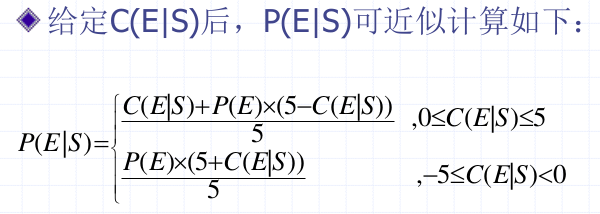

# 人工智能复习

**多看课件**，进行理解，主要考察知识面的覆盖情况（关键算法是否了解）

成绩组成：考试 * 80% + 实验 * 20%（贝叶斯占5分、重排九宫10分）

## 基本题型

### 简答题（30~50分）

以概念为主，主要包括名词解释等

### 简单计算题

出现在有计算的地方（例如模糊集球笛卡尔积、复合、多为模糊推理、知识不确定性（带权值）、前件带不确定性的可信度模型）

### 复杂计算题

（例：决策树中：过度拟合？欠学习？）

## 第一章 绪论

### 1.1什么是人工智能

#### 关于智能的3个观点

- 思维理论
  - **认为智能的核心是思维。**人的一切智慧或者智能都来自于大脑的思维活动，人类的一切知识都是人们思维的产物。因而通过对思维规律与思维方法的研究可望揭示智能的本质。
- 知识阈值理论
  - **强调知识对于智能的重要意义和作用**， 认为智能行为取决于知识的数量及其一 般化的程度。 
  - 智能就是在巨大知识库中迅速找到一个 满意解的能力。
- 进化理论
  - 人的本质能力是在动态环境中的行走能力，对外界事务的感知能力，维持生命的能力和繁衍生息的能力，正是这些能力为智能的发展提供了基础。**对外界事物的感知能力、对动态环境的适应能力是智能的重要基础及组成部分。**
- 我们认为
  - **智能是知识与智力的总和。**知识是智能行为的**基础**，智力是获取知识、运用知识的**能力**，它来自于人脑的思维活动。 同时，对外界事物的感知能力，是智能的**重要基础及组成部分**。

#### 智能的具体特征

- 具有感知能力
- 具有记忆与思维能力
- 具有学习能力及自适应能力
- 具有行为能力

#### 人工智能的研究目标

- 就是用人工的方法在计算机上实现智能
- 图灵测试
  - 测试者A，被测试者B与C。 
  - A是人，B与C一个是人，另一个是计算机。
  - A提出问题，B与C分别回答。
  -  如果B与C的回答，使得A无法区分B与C哪一个是计算机，哪一个 是人，则认为计算机具有了智能。
- 深蓝

### 1.2 *人工智能发展简史

人工智能的发展到目前为止经历的三个阶段

- 第一阶段：孕育（1956年之前） 
- 第二阶段：形成（1956～1969）
-  第三阶段：发展（1970年至今）

### 1.3 *人工智能研究方法

### 1.4 *人工智能研究及应用领域

## 第二章 知识工程

### 2.1 概述

#### 什么是知识

1. 数据与信息

   数据是信息的载体和表示；信息是数据的语义。 

2. 知识

   一般来说，**把有关信息关联在一起所形成的信息结构称为知识**。

#### 知识的特性

1. 相对正确性

   知识是经验的总结，**有一定的适用条件**。

2. 不确定性

   1. **随机性**：如果头痛且流涕，则可能患了感冒
   2. **模糊性**：高个子适合于打篮球。
   3. **不完全性**：对事物认识上的不完全、不准确导致知识 的不确定性。
   4. **经验性**：经验性知识本身就具有不确定性。 专家系统中大部分知识都具有不确定性。

3. 可表示性与可利用性

#### 知识的分类

按作用范围： 

- 常识性知识：人们普遍知道的知识，即所谓常识。 
- 领域性知识：具体应用领域中的专业性知识。 

按作用及表示：

- 事实：用于描述领域内有关概念、事物的属性及状态 （即对事实的描述：雪是白色的） 
- 规则：反应事物之间的因果关系

按确定性： 

- 确定性知识：是指可指出其真值为真或假的知识，它是精确性的知识。
-  不确定性知识：是指具有 “不确定”特性的知识，它是对不精确、不完全、及模糊性知识的总称。

### 2.2知识表示方法

**知识表示**：就是对知识的一种描述，一种计算机可以接受的用于描述知识的数据结构。

**知识的两大类表示方法**： 

- 符号表示法：主要用来表示逻辑性知识。 （包括本章讨论的各种方法）
- 连接机制表示法：是用神经网络表示知识的一种方法。

#### 2.2.1 经典逻辑表示法

##### 命题逻辑

*定义2.1：命题是具有真假意义的语句。*

在命题逻辑中命题通常用大写英文字母表示。 

命题逻辑无法把客观事物的结构及逻辑关系反映出来，也不能把不同事物间的共同特点表述出来。

##### 谓词逻辑

1. **一个谓词分为谓词名与个体两个部分。**
- 谓词名刻画个体的性质、状态或个体间的关系。
  
- 个体表示独立存在的事物或者概念。

谓词的一般形式

$P (x_1, x_2,…,x_n)$

其中，$P$是谓词名，$x_1, x_2,…,x_n$是个体。谓词名通常用大写的英文字母表示，个体通常用小写的英文字母表示。

2. **个体可以是常量、变元或者函数。**

3. **谓词的语义由人指定。**

4. **连接词：可以使用连接词构造简单的谓词公式。**

5. **谓词公式**

   **定义： 按下述规则得到的合式公式：**

##### 一些重要的等价式

##### 一些重要的永真蕴含式

##### 推理规则

上述等价式和永真蕴含式可以作为推理规则。此外，谓词逻辑中还有如下一些推理规则：

1. $P$规则：在推理的任何步骤都可以引入前提。

2. $T$规则：推理时，如果前面步骤中有一个或者多个公式永真蕴含公式$S$，则可把$S$引入推理过程中

3. $CP$规则：如果能从R和前提集合中推出S来，则可从前 提集合推出$R\rightarrow S$

4. 反证法：$P \Rightarrow Q$，当且仅当 $P \land \lnot \Leftrightarrow Q$。 即 $Q$ 为 $P$ 的逻辑结论，当且仅当$P \land \lnot Q$是不可满足的。 

   *定理: $Q$为$P_1 ,P_2 ,…,P_n$的逻辑结论，当且仅当$(P_1\land P_2\land…\land P_n)\land \lnot Q$是不可满足的*。

5. 逻辑推理：运用等价式、永真蕴涵式、及上述推理规则进行推理。

##### 基于谓词逻辑的知识表示

谓词逻辑可以表示事物的状态、属性等事实性的**知识**， 也可以用来表示事物间**确定的因果关系**，即**规则**。

用谓词公式表示知识时，需要首先**定义谓词**，指出每个谓词的**确切语义**，然后再用**连接词**把有关的谓词连接起来，形成一个**谓词公式**表达一个完整的意义。

##### 一阶谓词逻辑表示法的特点

 优点： 

1. **自然性** 接近自然语言的形式语言，用它表示的知识比较容易理解
2. **精确性** 谓词逻辑是二值逻辑，表示精确知识，可保证演绎推理结论的精确性
3. **严密性** 严格的形式定义及推理规则
4. **容易实现** 容易转换为计算机的内部形式，易于在计算机上实现

缺点： 

1. 不能表示不确定性的知识、启发性知识、元知识
2. **组合爆炸**
3. **效率低**

#### 2.2.2 产生式表示法

美国数学家E.Post在1943年首先提出**“产生式”** 这一术语。 他设计的产生式系统，称为Post系统。其目的是构造一种形式化的计算工具，并证明它具有和图灵机同样的计算能力。目前它已经成为人工智能中应用最多的一种知识表示方法。很多成功的专家系统都是用它来表示知识。例如费根保姆等人研制的分析化学分子结 构的专家系统DENDRAL；肖特里菲等人研制的 诊断传染性疾病的专家系统MYCIN等等。产生式形式上很简单，但在一定意义上**模仿了人类思考的过程**

##### 产生式的基本形式

- 事实的表示

三元组：老王年龄已40 表示为 （wang,age,40） 

​				老王与老张是朋友:（friendship, wang,zhang)

四元组：表示不确定性的知识 （friendship, wang, zhang，0.8)

- 规则的表示

  - 基本形式: 
    $$
    P\rightarrow Q
    $$

  - 或者: 
    $$
    If\quad P\quad Then\quad Q
    $$

​	其中，P是前提，用于指出该产生式是否可用的条件。Q是结论或者操作，用于指出当前提P满足时，应该得出的结论或者应 该执行的操作。

##### 产生式与谓词逻辑蕴含式的区别

蕴含式只能表示精确知识；而产生式不仅可以表示 精确知识，还可以表示不精确知识。

产生式中前提条件的匹配可以是**精确的**，也可以是**非精确的**；而谓词逻辑蕴含式总要求**精确匹配**。

##### 产生式系统

一个产生式系统一般由三部分组成：**规则库**、**综合数据库**、**控制系统**。

**规则库**

用于描述相应领域知识的产生式集合。 

建立规则库时，应该注意： 

1. 有效地表达领域内的各种规则。 
2. 便于对知识进行合理的组织与管理。

**综合数据库**

又称为事实库、上下文、黑板等等。

存放已知的事实和推导出的事实; 

数据结构: 符号串、向量、集合、数组、树、表格、文件等。

**控制机制**

又称为推理机构，负责整个产生式系统的运行。

控制机制完成的工作有：

- 按照一定的策略，匹配规则的条件部分；
- 当多于一条的规则匹配成功时（称为冲突）， 选择其中一条规则加以执行(冲突消解)；
- 将匹配规则的结论部分放入综合数据库（直 接添加到数据库中，或者替换其中的某些内容）；或者执行相应操作；
- 计算结论的不确定性；
- 决定系统何时终止运行。

##### 产生式系统求解问题的一般步骤 （正向推理）

1. 初始化事实库； 
2. 若规则库中存在尚未使用过的规则，且可匹配成功，则转第3步。否则转第5步
3. 执行当前选中的规则，并把结论送入事实库
4. 检查事实库中是否已经包含了解。若有则终止推理。若无则转第2步
5. 要求用户增添事实。若有则转第2步。若无则终止推理

##### 产生式系统的分类

按推理方向划分：正向(数据驱动)、后向 (目标驱动)和双向产生式系统

按确定性划分：确定性和不确定性产生式系统

##### 产生式表示法的特点 

优点： 

1. **自然性** 

   “如果…则…”形式是人们常用的一种表示因果关系的知识表示形式，直观、自然、便于进行推理

2. **模块性**

3. **有效性**

   即可表示确定性知识，又可表示不确定性知识；既有利于表示启发式知识，又可便于表示过程性知识

4. 清晰性

​		格式固定

缺点： 

1. 效率不高 反复执行“匹配——冲突消解——执行”过程，容易引起组合爆炸
2. 不能表达具有结构性的知识

#### 2.2.3 *层次结构表示法

### 2.3 *知识获取与管理

### 2.4 *基于知识的系统

---

## 第3章 确定性推理

### 3.1 概述

#### 3.1.1 推理方式与分类

所谓推理就是按某种策略由**已知判断**推出**另一个判断**的思维过程

在人工智能中，推理是由程序实现的， 称为**推理机**。

1. 演绎推理、归纳推理、默认推理

   - 演绎推理：从一般到特殊。例如三段论

   - 归纳推理：从个体到一般

   - 默认推理：缺省推理，在知识不完全的情况下假设某些条件已经具备所进行的推理

2. 确定性、不确定性推理

3. 单调推理、非单调推理
   - 推出的结论是否单调增加（演绎推理，缺省推理）
4. 启发式、非启发式推理
   - 所谓启发性知识是指与问题有关且能加快推理进程、 求得问题最优解的知识。 
5. 基于知识的推理（专家系统） 、统计推理、直觉推理 （常识性推理）

#### 3.1.2 推理的控制策略

推理的控制策略主要包括：推理方向、搜索策略、冲突消解策略、求解策略及限制策略。

1. 正向推理（数据驱动推理）

​		正向推理的基本思想是：从用户提供的**初始已知事实**出发，在知识库KB中找出当前可适用的知识，构成可适用的知识集KS，然后按某种**冲突消解策略**从KS中选出一条知识进行推理，并将推出的新事实加入到数据库DB中，作为下一步推理的已知事实。在此之后，再在知识库中选取可适用的知识进行推理。如此重复进行这一过程，直到求得所要求的解。

​	2. 逆向推理

​		逆向推理的基本思想是：首先选定一个**假设目标**，然后**寻找支持该假设的证据**， 若所需的证据都能找到，则说明原假设是成立的；推理完成。若找不到所需要的证据，则说明原假设不成立，此时需要另作新的假设。

 3. 混合推理

    先正向推理后逆向推理先逆向推理后正向推理

 4. 双向推理
    正向推理与逆向推理同时进行，且在推理过程 中的某一步上“碰头” 

 5. 求解策略

    只求一个解，还是求所有解以及最优解

 6. 限制策略

    限制搜索的深度、宽度、时间、空间等等

#### 3.1.3 知识匹配

所谓模式匹配(知识匹配)是指对两个知识模式(例如两个谓词公式、框架片断、语义网络片断)进行比较， 检查这两个知识模式是否完全一致或者近似一致。

模式匹配可分为确定性匹配与不确定性匹配。 

- 确定性匹配是指两个知识模式完全一致，或者经过 变量代换后变得完全一致。 

  - 知识：IF father(x,y) and man(y) THEN son(y,x) 

  - 事实：father(李四，李小四) and man(李小四) 

- 不确定性匹配是指两个知识模式不完全一致，但是 它们的相似程度又在规定的限度内。

##### 变量代换

*定义3-1  代换是一个形如$\{t_1/x_1, t_2/x_2, ..., t_n/x_n\}$的有限集合。*

​		其中$t_1 ,t_2 ,…,t_n$是项（常量、变量、函数);$x_1 ,x_2 ,…,x_n$是（某一公式中）互不相同的变元; $ t_i /x_i$表示用$t_i$代换$x_i$ ;不允许$t_i$与$x_i$相同，也不允许变元$x_i$循环地出现在另一个$t_j$中。

​		令$\theta=\{t_1/x_1, t_2/x_2, ..., t_n/x_n\}$为一个代换，$F$为表达式，则$F_θ$表示对$F$用$t_i$代换$x_i$后得到的表达式。$ F_θ$称为$F$的特例。

##### 代换的复合

*定义3-2* 设
$$
\theta=\{t_1/x_1, t_2/x_2, ..., t_n/x_n\}\\
\lambda=\{u_1/y_1, u_2/y_2, ..., u_m/y_m\}
$$
是两个代换，则这两个代换的复合也是一个代换，它是从
$$
\{t_1\lambda/x_1, t_2\lambda/x_2, ..., t_n\lambda/x_n, u_1/y_1, u_2/y_2, ..., u_m/y_m\}
$$
中删去如下两种元素：
$$
t_i\lambda/x_i\quad while\ t_i\lambda=x_i\\
u_i/y_i\quad while\ y_i\in \{x_1 ,x_2 ,…,x_n\}
$$
后剩下的元素所构成的集合，记为$\theta ° \lambda$。

$t_i\lambda/x_i$表示对$t_i$运用$\lambda$进行代换。

$\theta ^o \lambda$就是对一个公式$F$先运用$\theta$进行代换，然后再运用$\lambda$ 进行代换$F(\theta ° \lambda) = (F \theta)\lambda$。

##### 代换的例子

##### 公式集的合一

*定义3-3* 设有公式集$F={F_1 ,F_2 ,…,F_n }$，若存在一个代换$λ$使得
$$
F_1λ=F_2λ=…=F_nλ
$$
则称$λ$为公式集F的一个合一，且称$F_1 ,F_2 ,…,F_n$是 可合一的。

##### 最一般的合一

*定义3-4* 设$σ$是公式集$F$的一个合一，如果对任一个合一$θ $都存在一个代换$λ$，使得$θ=σ°λ$ 则称$σ$是一个最一般的合一。

1. 代换过程是一个用项代替变元的过程，因此是一个**从一般到特殊**的过程。

2. 最一般合一是**唯一的**。

##### 求取最一般合一

差异集：两个公式中相同位置处不同符号的集合

求取最一般合一的算法： 

1. 令$k=0,F_k=F, σ_k=ε$。 $ε$是空代换

2. 若$F_k$只含一个表达式，则算法停止，$σ_k$就是最一般合一

3. 找出$F_k$的差异集$D_k$

4. 若$D_k$中存在元素$x_k$和$t_k$，其中$x_k$是变元，$t_k$是项，且$x_k$不在$t_k$中出现，则置：
   $$
   F_{k+1}=F_k \{t_k /x_k \} \\
   
   σ_{k+1}=σ_k °\{t_k /x_k \} \\
   
   k=k+1
   $$
   然后转(2)。若不存在这样的$x_k$和$t_k$则算法停止

5. 算法终止，$F$的最一般合一不存在。

##### 求取最一般合一的例子

### 3.2 自然演绎推理

​		从一组已知为真的事实出发，直接运用经典逻辑的推理规则推出结论的过程，称为自然演绎推理。其中，基本的推理规则是P规则、T规则、假言推理、拒取式推理等。

​		假言推理的一般形式
$$
P,P\rightarrow Q\Rightarrow Q
$$
​		拒取式推理的一般形式
$$
P\rightarrow Q, \lnot Q\Rightarrow \lnot P
$$
​		$P$规则：在推理的任何步骤都可以引入前提。
​		$T$规则：推理时，如果前面步骤中有一个或者多个公式永真蕴含公式$S$，则可把$S$引入推理过程中。

### 3.3 归结演绎推理

​		定理证明即证明$ P\rightarrow Q(\lnot P\lor \lnot Q) $的永真性。根据反证法，只要证明其否定$ (P∧¬Q) $不可满足性即可。
​		海伯伦(Herbrand)定理为自动定理证明奠定了理论基础；鲁滨逊(Robinson)提出的归结原理使机器定理证明成为现实。

#### 3.3.1 海伯论理论

在谓词逻辑中，把原子谓词公式及其否定统称为文字。如：$P(x)$， $¬P(x,f(x))$， $Q(x,g(x))$

*定义3-5： 任何文字的析取式称为子句。*

>例如：P(x)∨Q(x), ¬P(x,f(x))∨Q(x,g(x))

*定义3-6： 不包含任何文字的子句称为空子句。*

##### 子句集

合取范式：$ C_1\land C_2\land C_3\land...\land C_n $

子句集：$ S = \{C_1,C_2, ...,C_n\} $

任何谓词公式$F$都可通过等价关系及推理规则化为相应的子句集$S$。

##### 把谓词公式化成子句集的步骤

一般过程

1. 消去蕴含和等价

	

2. 移动否定符号

	

3. 变量标准化

4. 消去存在量词

	

5. 化为前束型

	

6. 化为Skolem标准型

	

7. 略去全称量词

	

8. 消去合取词，把母式用子句集表示

	

9. 子句变量标准化
    不同的子句用不同的变元

  

##### 子句集的意义

子句集$S$的不可满足性：对于任意论域中的任意一个解释，$S$中的子句不能同时取得真值$T$。

*定理3-1 设有谓词公式$F$，其子句集为$S$，则$F$不可满足的充要条件是$S$不可满足。*

> 要证明$P→Q$ (即$¬P∨Q$)永真，只需证明公式$F=(P∧¬Q)$永假，即证明$S$不可满足。

##### Herbrand理论

为了判断子句集的不可满足性，需要对所有可能论域上的所有解释进行判定。只有当子句集对任何非空个体域上的任何一个解释都是不可满足的，才可断定该子句集是不可满足的。

海伯伦构造了一个特殊的论域(海伯伦域)，并证明只要对这个特殊域上的一切解释进行判定，就可知子句集是否不可满足。

#### 3.3.2 鲁滨逊归结原理

鲁滨逊归结原理的基本思想：检查子句集$S$中是否包含空子句。若**包含**，则$S$不可满足；若**不包含**，就在子句集中选择合适的子句进行**归结**，一旦**通过归结能推出空子句**，就说明子句集$S$是**不可满足**的。

子句集$S$的不可满足性：对于任意论域中的任意一个解释，$S$中的子句不能同时取得真值$T$。一旦$S$中包含空子句，则$S$必不可满足。

##### 命题逻辑中的归结原理

*定义3-9 若$P$是原子谓词公式，则称$P$与$¬P$为互补文字。在命题逻辑中，$P$为命题。*

*定义3-10 设$C_1$ 与$C_2$ 是子句集中的任意两个子句。如果$C_1$ 中的文字$L_1$ 与$C_1$ 中文字$L_2$ 互补，那么从$C_1$ 和$C_1$ 中分别消去$L_1$ 和$L_2$  ，并将两个子句中余下的部分析取，构成一个新子句$C_{12}$ ，则称这一过程为**归结**。称$C_{12}$为$C_1$和$C_2$的归结式，$C_1$和$C_2$ 为$C_{12}$ 的亲本子句。*

*定理3-4 $C_{12}$是其亲本子句$C_1$ 与$C_2$ 的逻辑结论。*

推论1 设$C_1$ 与$C_2$ 是子句集S中的两个子句，$C_{12}$是它们的归结式。若用$C_{12}$代替$C_1$ 和$C_2$ 后得到新子句集$S_1$ ，则由$S_1$的不可满足性可推出原子句集$S$的不可满足性，即
$$
S_1 的不可满足性\Rightarrow S的不可满足性
$$
推论2 设$C_1$ 与$C_2$是子句集S中的两个子句，$C_{12}$是它们的归结式。若把$C_{12}$加入$S$中得到新子句集$S_2$ ，则$S$与$S_2$在不可满足的意义上是等价的，即
$$
S_2 的不可满足性\Leftrightarrow S的不可满足性
$$
为了要证明子句集$S$的不可满足性，只要对其中**可进行归结的子句进行归结**，并**把归结式加**
**入子句集$S$**，或者$用归结式替换它的亲本子句$，然后对新子句集($S_1$ 或者$S_2$ )证明不可满足性就可以了。**如果经过归结能得到空子句，则立即可得原子句集$S$是不可满足的结论。**

在命题逻辑中，归结原理是**完备的**。即，**若子句集不可满足，则必然存在一个从S到空子句的归结演绎。**

在谓词逻辑中，由于子句中含有**变元**，所以不能像命题逻辑那样直接消去互补文字，而需要先用**最一般合一**对变元进行代换，然后才能进行归结。

##### 二元归结式的定义

定义3-11 设$C_1$ 与$C_2$是两个没有相同变元的子句，$L_1$ 和 $¬ L_2$ 分别是$C_1$ 和$C_2$中的文字。若 $σ$ 是$L_1$ 和 $¬ L_2$ 的最一般合一，则称
$$
C_{12} =(C_1σ-\{L_1σ\})∨(C_2σ-\{¬L_2σ \})
$$
为$C_1$ 和$C_2$的二元归结式，$L_1$ 和 $¬L_2$ 称为归结式上的文字。

若子句$C$含有可合一的文字，则在进行归结之前应先对这些文字进行合一。记其最一般的合一为$σ$，称$Cσ$为 子句$C$的因子。若$Cσ$是一个单文字，则称它为$C$的单元因子。

定义3-12 子句$C_1$ 和$C_2$ 的归结式是下列二元归结式之一：

- $C_1$ 与$C_2$的二元归结式；
- $C_1$ 与$C_2$的因子$C_2 σ_2$ 的二元归结式；
- $C_1$的因子$C_1 σ_1$与$C_2$的二元归结式；
- $C_1$的因子$C_1 σ_1$与$C_2$的因子$C_2 σ_2$的二元归结式。

对于一阶谓词逻辑，归结原理也是完备的。即，**若子句集$S$不可满足，则必然存在一个从$S$到空子句的归结演绎。**

---

## 第四章 不确定性推理

### 4.1 概述

什么是不确定性推理?

不确定性推理是建立在非经典逻辑基础上的一种推理，它是对不确定性知识的运用与处理。

具体地说，所谓不确定性推理就是**从不确定性的初始证据（即事实）出发**，通过**运用不确定性的知识（即规则）** ，最终**推出具有一定程度不确定性的结论**。

#### 不确定性推理中的基本问题

1. 不确定性的表示与度量不确定性

	推理中的“不确定性”一般分为两类：

	**知识不确定性**的表示：在专家系统中知识的不确定性一般是由领域专家给出的，通常用一个数值表示，它表示相应知识的不确定性程度，称为知识的**静态强度**。

	**证据不确定性**的表示：证据不确定性的表示方法与知识不确定性的表示方法一致，通常也用一个数值表示，代表相应证据的不确定性程度，称之为**动态强度**。

2. 不确定性匹配算法
	
	在推理过程中**证据和知识的前提的相似程度称为匹配度**。确定这个匹配度（相似程度）的算法称为不确定性匹配算法。

3. 组合证据不确定性的计算方法

	

​	其中， T(E) 表示证据 E 为真的程度（动态强度），如可信度、概率等。

4. 不确定性的传递算法

  在每一步推理中，如何把证据及知识的不确定性传递给结论，即如何计算结论的不确定性。

5. 结论不确定性的合成

  用不同知识进行推理得到了相同结论，但所得结论的不确定性却不同。此时，需要用合适的算法对结论的不确定性进行合成。

#### 不确定性推理方法的分类

不确定性推理方法主要可分为**模型法**与**控制法**。

**模型法**：在推理一级对确定性推理进行扩展，引入证据的不确定性及知识的不确定性。

模型方法又分为**数值方法**和**非数值方法**两类。数值方法对不确定性进行定量的描述，按其所依据的理论又可分为**基于概率的方法**和基于模糊理论的方法。

### 4.2 基本概率方法

#### 经典概率方法

设有如下产生式规则：
$$
IF\ E\ THEN\ H
$$

其中， $E$ 为前提条件， $H$ 为结论。如果我们在实践中经大量统计能得出在 $E$ 发生条件下 $H$ 的条件概率（后验概率） $P(H/E)$ ，那么就可把它作为在证据 $E$ 出现时结论 $H$ 的确定性程度（可信度）。

#### *逆概率方法

### 4.3 主观Bayes方法

#### 4.3.1 不确定性的表示

##### 1、知识不确定性的表示

在主观Bayes方法中，知识是用产生式规则表示的，具体形式为：
$$
IF\ E\ THEN\ (LS,LN)\ H\ (P(H))
$$
其中，$E$是知识的前提条件，既可以是**简单条件**，也可以是**复合条件**。

$P(H)$是结论$H$的先验概率，由专家根据经验给出。
$LS$称为**充分性度量**，用于指出$E$对H的支持程度，取值范围为$[0,∞)$，其定义为：
$$
LS=P(E|H)/P(E|¬ H)
$$
LN称为**必要性度量**，用于指出$¬E$对H的支持程度，取值范围为$[0,∞)$，其定义为：
$$
LN=P(¬ E|H)/P(¬ E|¬ H)=(1-P(E|H))/(1-P(E|¬ H))
$$
$LS$和$LN$的值由领域专家给出，代表知识的**静态强度**。

##### 2、证据不确定性的表示

在主观Bayes方法中，证据的不确定性用**概率**表示。对于证据$E$，由用户根据观察S给出$P(E|S)$，即**动态强度**。用$P(E|S)$描述证据的不确定性 （证据$E$无法直接观测到）。

由于主观给定$P(E|S)$有所困难，所以实际中可以**用可信度$C(E|S)$代替$P(E|S)$**。

在PROSPECTOR中$C(E|S)$取整数：{-5，….5}
$C(E|S)=-5$表示在观测S下证据E肯定不存在:$P(E|S)=0$
$C(E|S)= 5$表示在观测S下证据E肯定存在:$P(E|S)=1$
$C(E|S)= 0$表示S与E无关,即:$P(E|S)= P(E)$

##### 3、组合证据的不确定性

当组合证据是多个单一证据的**析取**时，
$$
P(E|S)=min\{P(E_1 |S),P(E_2 |S),…,P(E_n |S)\}
$$
当组合证据是多个单一证据的**合取**时，
$$
P(E|S)=max\{P(E_1 |S),P(E_2 |S),…,P(E_n |S)\}
$$
对于$¬$运算，
$$
P(¬ E|S)=1-P(E|S)
$$

#### 4.3.2 不确定性的传递算法

1. 根据证据E的条件概率P(E|S) 及LS、LN的值， 把H的先验概率P(H)更新为后验概率P(H|S) 。

2. 分以下3种情况讨论：
   - 证据肯定存在： $P(E|S)=1$
   - 证据肯定不存在： $P(E|S)=0$ 
   - 证据不确定： $0<P(E|S)<1$

（3）引入几率函数$Θ(x)$,它与概率的关系为：
$$
Θ(x)=P(x)/(1-P(x)), P(x)=Θ(x)/(1+Θ(x))
$$

##### 证据肯定存在时

##### 证据肯定不存在时

##### 证据不确定时

$LS$和$LN$的性质
$$
Θ(H|E) =LS×Θ(H)\\Θ(H|¬E)=LN×Θ(H)
$$

- LS>1: 表明证据 E是对H有利的证据
- LN>1：表明证据¬E是对H有利的证据

所以： 不能出现LS>1且LN>1的取值

- LS<1: 表明证据 E是对H不利的证据
- LN<1：表明证据¬E是对H不利的证据

所以： 不能出现LS<1且LN<1的取值

**一般情况下，取LS>1， LN<1。**

#### 4.4.3 结论不确定性的合成算法

若有n条规则支持相同的结论H，即
$$
IF\ E_i\ THEN\ (LS_i,LN_i)\ H\ (P(H)),i=1,…,n
$$
且每条知识的前提条件所对应的证据$Ei (i=1,2,…,n)$都有相应的观察$S_i$与之对应，则该n条规则均可启用。此时只要先对每条知识分别求出几率函数$Θ(H|S_i)$，然后就可运用下述公式求出$Θ(H|S_1S_2…S_n )$:
$$
\Theta(H|S_1S_2 ... S_n)=\frac{\Theta(H|S_1)}{\Theta(H)}\cross \frac{\Theta(H|S_2)}{\Theta(H)} \cross ... \cross\frac{\Theta(H|S_n)}{\Theta(H)}\cross \Theta(H)
$$

##### 主观Bayes方法的特点

优点： 

- 主观Bayes方法中的计算公式大多是在概率论的基础上推导出来的，具有较坚实的理论基础
- 知识的静态强度$LS$及$LN$是由领域专家给出，避免了大量的数 据统计工作
- 主观Bayes方法不仅给出了**证据肯定存在**、**肯定不存在时**更新后验概率的方法，还给出了**证据不确定时**的更新方法，**实现了不确定性的逐级传递**

缺点：

- 它要求领域专家在**给出知识时，同时给出H的先验概率$P(H)$**， 这比较困难

